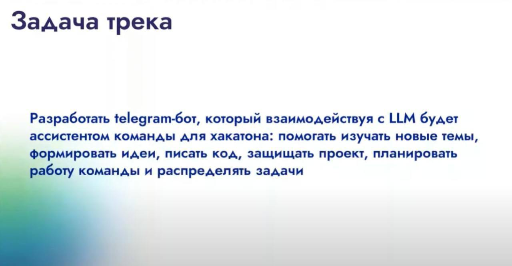

### Ссылка на bot_AK12: https://t.me/ai_arrows_bot

# Описание проекта

Этот проект представляет собой Telegram-бота, использующего OpenAI API для выполнения различных задач, связанных с хакатоном. Бот предоставляет пользователям возможность получения информации, генерации идей, написания кода и планирования работы команды через команды в Telegram.

## Структура кода

### 1. Импорт библиотек

В этом блоке импортируются необходимые библиотеки для работы с Telegram API, OpenAI API и загрузки переменных окружения.

### 2. Загрузка переменных окружения

Этот блок загружает токены и ключи из файла `.env` под '.gitignor', обеспечивая безопасное использование конфиденциальных данных. 

### 3. Обработчики команд

Функции в этом блоке обрабатывают команды, отправленные пользователем в Telegram. Каждая функция реализует конкретную команду бота:

- **`/start`**: Приветственное сообщение при запуске бота.
- **`/help`**: Отправляет сообщение с описанием доступных команд.
- **`/study_topic <тема>`**: Предоставляет информацию по указанной теме.
- **`/generate_ideas <контекст>`**: Генерирует идеи на основе предоставленного контекста.
- **`/write_code <описание>`**: Пишет код по указанному описанию.
- **`/defend_project <вопрос>`**: Отвечает на вопросы для защиты проекта.
- **`/plan_work <описание>`**: Создает план работы команды на основе предоставленного описания.
- **`/assign_tasks <описание>`**: Распределяет задачи среди членов команды.

### 4. Генерация ответов

Этот блок отвечает за взаимодействие с API OpenAI для генерации ответов на запросы пользователя. 

### 5. Основной запуск бота

Создание и настройка Telegram-бота, добавление обработчиков команд и запуск цикла прослушивания сообщений. Если асинхронный цикл уже запущен, добавляется корутина в существующий цикл; в противном случае создается новый цикл.

